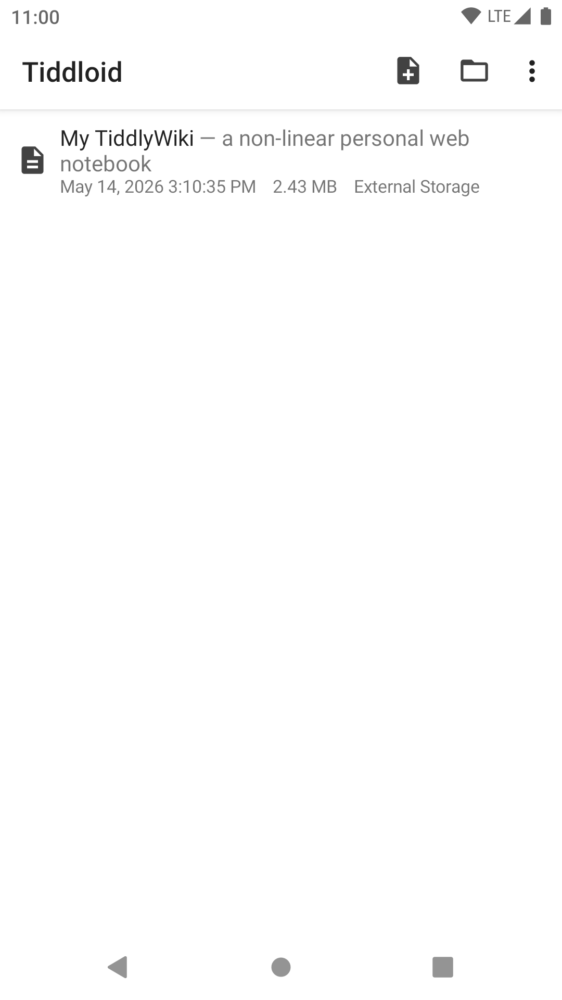
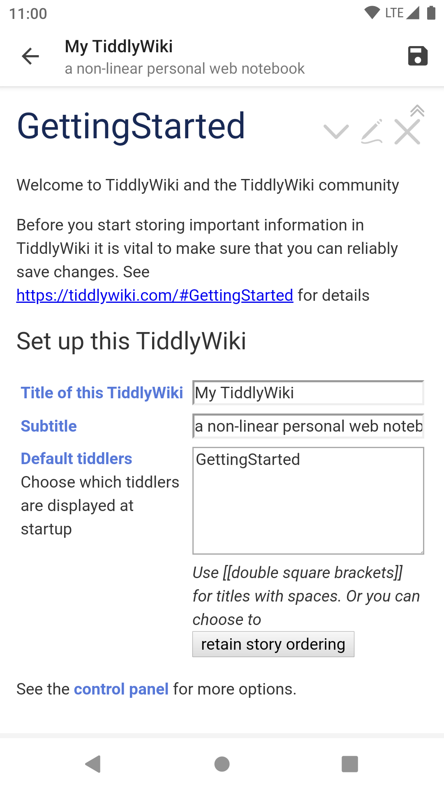
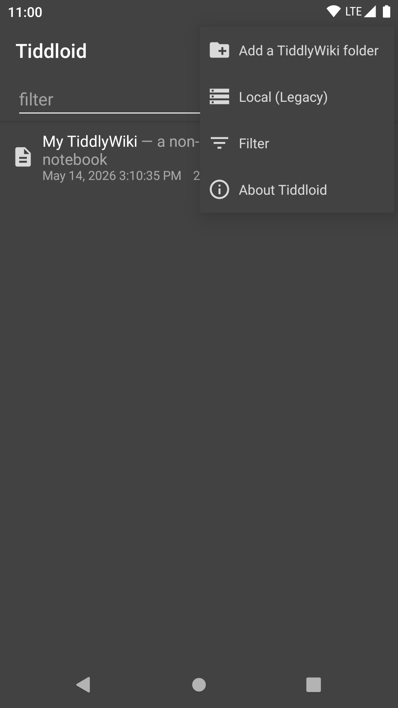
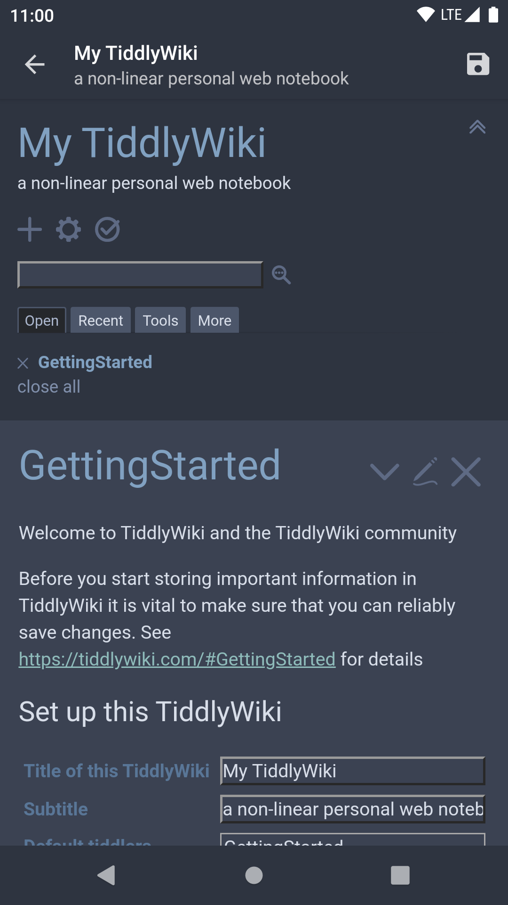

# Tiddloid

&ensp;&ensp;&ensp;&ensp;

Tiddloid是一款适用于本地存储的TiddlyWiki的应用程序。一旦有了一些想法，您可以立即将它们写下来以供随时查阅。

&emsp;&emsp;&emsp;

有关TiddlyWiki的更多详细信息，请参阅https://tiddlywiki.com/。

### 主要功能

* 使用最新模板创建新的Wiki
* 导入存储在可写来源的现有Wiki
* 添加一个包含基于TiddlyWiki的`index.htm(l)`的文件夹（Android 5.0+）
* 接收从浏览器分享的TiddlyWiki站点URL并存为新文件或书签
* 打开一个HTML文件，如果是TiddlyWiki则添加到列表
* 通过Wiki内配置实现应用主题色到系统界面，以及其他调整选项
* 点击保存按钮保存更改
* 上下文菜单中的保存和查找选项
* 随选随记功能
* 历史版本备份功能

### FAQ

* 我可以导入/导出Wiki列表吗？

    Wiki列表导入/导出属于极少用到的隐藏功能。

    * 导入：在第一次运行前复制`data.json`到`内部存储/Android/data/top.donmor.tiddloid/files/`。如果已经运行过了，则需要清除应用数据。
    * 导出：安装`Tiddloid Tweaks`插件,然后在`Control Panel/Appearance/Tiddloid Tweaks`中点击`Export Data`。生成的`data.json`可以在`内部存储/Android/data/top.donmor.tiddloid/files/`找到。

* 如何调整界面？

    安装`Tiddloid Tweaks`插件并： 

    * 应用主题色：将`Control Panel/Appearance/Tiddloid Tweaks/Apply theme color to system bars`设为`Enabled`。如果设为`Light / Dark only`则只切换明亮/暗黑模式。
    * 隐藏标题栏：将`Control Panel/Appearance/Tiddloid Tweaks/Hide toolbar on loading complete`设为`Enabled`。如果设为`Landscape only`则只在横屏模式隐藏标题栏。
    * 自定义菜单项：在`Control Panel/Appearance/Tiddloid Tweaks`中点击`Custom Actions`创建配置Tiddler，并按提示编辑。

* 如何安装`Tiddloid Tweaks`插件?
    * 启用Wiki设置中的 `Tweaks插件自动更新`。插件将在页面加载完成时自动提示安装或更新。
    * 或从release页面获取`.tid`文件并导入目标文件。

* 从Google Drive导入的文件无法同步。

    尝试在Google Drive应用中将文件标记为“可离线使用”。（感谢@tedric42的反馈）

* 新建的Wiki出现JavaScript错误弹框并白屏。

    检查Android系统和TiddlyWiki版本。TiddlyWiki 5.1.23版本在Android 5.1及以下(WebView 39)存在严重bug。一个解决方案是使用已经修复了此bug的新版本，或者未出现此bug的旧版本。

* Wiki列表每次的顺序都在变化。

    检查Android系统版本。JSON库的一个实现在Android 4.4以下有所差异，导致了Wiki列表乱序问题。推荐在Android 8以上版本运行以获得最佳体验。

* 页面下方有时出现乱码。

    检查Android系统及Tiddloid版本。Android 10及以上系统中文件API可能存在问题，导致文件无法正常结尾。此问题已在Tiddloid 2.3.0中修复。将损坏的文件置于`[内置存储]/Android/data/top.donmor.tiddloid/files`并冷启动进入文件列表可执行批量修复（过大的文件可能导致OOM错误）。推荐在Android 8运行以获得最佳体验。

* 从1.4升级后，之前添加的Wiki全部失效了。

    检查系统权限设置页面处是否禁止了Tiddloid访问本地文件。旧模式（直接访问本地文件）默认不启用。要启用它，请打开“WebDAV / 本地（旧版）”并点击左上角的按钮。

* 我无法在文字选择浮动菜单中找到`添加到Tiddloid`等选项。

    * Android 11及以上系统版本中限制了对此菜单的访问。旧应用以及少部分特别进行了处理的应用仍能使用此功能。

* 我仍然想用旧模式添加Wiki。

    * 使用“本地（旧版）”选项。
    * 或者安装一个为旧版Android设计，仍使用`file://`URI的文件管理器，打开一个HTML文件，打开方式选择`Add to Tiddloid`。
    * 或者选中一段`file://`URI文本，选择`分享`->`Add to Tiddloid`。

* 为什么还有一个Tiddloid Lite？这两个版本有什么区别？

    在之前的1.x版本中，Tiddloid使用旧的`file://`协议打开文件，此方式不支持访问云存储。之后我制作了基于SAF（即Storage Access Framework）的Tiddloid Lite，最终成为一个轻量版。现在Tiddloid已经换用SAF，Tiddloid Lite将不再有功能性更新，但会保持轻量化并偶尔进行维护。

    以下是不同版本之间的差异：

    | 功能                   | Tiddloid 1.x                       | Tiddloid 2.0 及以上                   | [Tiddloid Lite](https://gitee.com/donmor/TiddloidLite) |
    |------------------------|------------------------------------|------------------------------------|--------------------------------------------------------|
    | 文件API                | Java文件API                          | Android SAF以及 Java文件API            | Android SAF                                            |
    | 备份系统               | 有                                  | 有                                  | 无                                                     |
    | 搜索-克隆系统          | 有                                  | 无（改为接收从浏览器分享的TiddlyWiki站点URL并保存）   | 无                                                     |
    | 下载服务               | 有                                  | 无                                  | 无                                                     |
    | 直接访问同目录下的文件 | 支持                                 | 部分支持（旧版模式，文件夹模式通过缓存所有文件）           | 不支持                                                 |
    | 云存储                 | 不支持                                | 支持（通过SAF）                          | 支持（通过SAF）                                        |
    | 模板                   | 首次使用时下载，可手动更新                      | 创建新文件时下载，并缓存以备无网络时使用               | 创建新文件时下载                                       |
    | 兼容性                 | 适配旧Android版本，支持TiddlyWiKi5及Classic | 适配新Android版本，支持TiddlyWiKi5及Classic | 适配新Android版本，支持TiddlyWiKi5                     |
    | 推荐的Android版本      | Android 4.4 ~ 9.0                  | Android 5.0 及以上，8.0最佳              | Android 4.4 及以上，8.0最佳                            |

### 许可

本应用程序遵循GPLv2许可发布，许可证文件随源代码提供（包括依赖的其他项目）。

### 多语言

此应用的翻译大多数由Google翻译提供。如果您有更好的版本，欢迎发起Pull Request。

### 隐私

本应用程序使用互联网连接获取模板数据和显示HTTP方式添加的页面，在此过程中不会收集您的数据。另外，您在问题反馈过程中提供的任何信息将被妥善用于解决问题且仅用于此用途。

注意：任何发布在Issues的信息将对所有人可见。

### 关于作者

感谢您尝试我们的作品。如果您愿意支持，本人将不胜感激，并不遗余力地加以改进。

&ensp;&ensp;&ensp;&ensp;

欢迎访问[我的主页](https://donmor.top/)。

您还可以访问[太记的项目页面](https://github.com/tiddly-gittly/TidGi-Desktop)，了解有关中文版桌面应用程序的更多信息。
